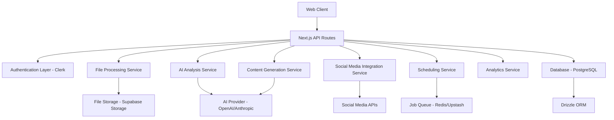

# Design Document

## Overview

The Book Social Content Analyzer is a Next.js web application that leverages AI to analyze uploaded books and generate platform-specific social media content. The system integrates with major social media platforms (Twitter/X, Instagram, LinkedIn, Facebook) to enable direct publishing and scheduling. The application uses a modern tech stack including Next.js 15, React 19, Drizzle ORM with PostgreSQL, and Clerk for authentication.

## Architecture

### High-Level Architecture



### Technology Stack

- **Frontend**: Next.js 15, React 19, TypeScript, Tailwind CSS
- **Backend**: Next.js API Routes, Drizzle ORM
- **Database**: PostgreSQL (Supabase)
- **Authentication**: Clerk
- **File Storage**: Supabase Storage
- **AI Processing**: OpenAI GPT-4 or Anthropic Claude
- **Social Media APIs**: Twitter API v2, Instagram Basic Display API, LinkedIn API, Facebook Graph API
- **Job Scheduling**: Upstash Redis for queue management
- **UI Components**: Radix UI, Lucide React icons

## Components and Interfaces

### Core Components

#### 1. Book Management System
- **BookUploader**: Handles file upload with drag-and-drop interface
- **BookLibrary**: Displays user's uploaded books with metadata
- **BookViewer**: Shows book details and analysis results
- **FileProcessor**: Extracts text from various file formats (PDF, EPUB, TXT, DOCX)

#### 2. AI Analysis Engine
- **TextAnalyzer**: Processes book content to extract themes, quotes, and insights
- **ContentExtractor**: Identifies key passages and memorable quotes
- **ThemeIdentifier**: Categorizes content by themes and topics
- **SummaryGenerator**: Creates chapter and overall book summaries

#### 3. Content Generation System
- **PlatformContentGenerator**: Creates platform-specific social media posts
- **ContentVariationGenerator**: Produces multiple versions of each post
- **HashtagGenerator**: Suggests relevant hashtags for each platform
- **ImageSuggestionEngine**: Recommends visual content for posts

#### 4. Social Media Integration
- **SocialAccountManager**: Handles OAuth connections to social platforms
- **PublishingService**: Posts content to connected accounts
- **SchedulingService**: Manages queued posts for future publishing
- **AnalyticsCollector**: Gathers engagement metrics from published posts

#### 5. User Interface Components
- **Dashboard**: Main interface showing books, generated content, and analytics
- **ContentEditor**: Rich text editor for reviewing and modifying generated posts
- **SchedulingCalendar**: Visual interface for managing scheduled posts
- **AnalyticsDashboard**: Displays performance metrics and insights

### API Interfaces

#### Book Management APIs
```typescript
// Upload and process book
POST /api/books/upload
POST /api/books/{bookId}/analyze

// Book library management
GET /api/books
GET /api/books/{bookId}
DELETE /api/books/{bookId}
```

#### Content Generation APIs
```typescript
// Generate social media content
POST /api/content/generate
GET /api/content/{bookId}
PUT /api/content/{contentId}
DELETE /api/content/{contentId}
```

#### Social Media APIs
```typescript
// Account management
POST /api/social/connect/{platform}
GET /api/social/accounts
DELETE /api/social/accounts/{accountId}

// Publishing and scheduling
POST /api/social/publish
POST /api/social/schedule
GET /api/social/scheduled
DELETE /api/social/scheduled/{postId}
```

#### Analytics APIs
```typescript
// Performance tracking
GET /api/analytics/posts
GET /api/analytics/engagement
GET /api/analytics/insights
```

## Data Models

### Database Schema

```typescript
// Books table
export const books = pgTable("books", {
  id: uuid("id").defaultRandom().primaryKey(),
  userId: text("user_id").notNull(),
  title: text("title").notNull(),
  author: text("author"),
  genre: text("genre"),
  fileUrl: text("file_url").notNull(),
  textContent: text("text_content"),
  analysisStatus: text("analysis_status").default("pending"),
  analysisData: json("analysis_data"),
  createdAt: timestamp("created_at").defaultNow().notNull(),
  updatedAt: timestamp("updated_at").defaultNow().notNull()
});

// Generated content table
export const generatedContent = pgTable("generated_content", {
  id: uuid("id").defaultRandom().primaryKey(),
  bookId: uuid("book_id").references(() => books.id).notNull(),
  userId: text("user_id").notNull(),
  platform: text("platform").notNull(), // twitter, instagram, linkedin, facebook
  contentType: text("content_type").notNull(), // post, story, article
  content: text("content").notNull(),
  hashtags: text("hashtags").array(),
  imageUrl: text("image_url"),
  status: text("status").default("draft"), // draft, scheduled, published
  scheduledAt: timestamp("scheduled_at"),
  publishedAt: timestamp("published_at"),
  createdAt: timestamp("created_at").defaultNow().notNull(),
  updatedAt: timestamp("updated_at").defaultNow().notNull()
});

// Social media accounts table
export const socialAccounts = pgTable("social_accounts", {
  id: uuid("id").defaultRandom().primaryKey(),
  userId: text("user_id").notNull(),
  platform: text("platform").notNull(),
  accountId: text("account_id").notNull(),
  accountName: text("account_name").notNull(),
  accessToken: text("access_token").notNull(),
  refreshToken: text("refresh_token"),
  tokenExpiresAt: timestamp("token_expires_at"),
  isActive: boolean("is_active").default(true),
  createdAt: timestamp("created_at").defaultNow().notNull(),
  updatedAt: timestamp("updated_at").defaultNow().notNull()
});

// Analytics table
export const postAnalytics = pgTable("post_analytics", {
  id: uuid("id").defaultRandom().primaryKey(),
  contentId: uuid("content_id").references(() => generatedContent.id).notNull(),
  platform: text("platform").notNull(),
  postId: text("post_id").notNull(),
  impressions: integer("impressions").default(0),
  likes: integer("likes").default(0),
  shares: integer("shares").default(0),
  comments: integer("comments").default(0),
  clicks: integer("clicks").default(0),
  lastUpdated: timestamp("last_updated").defaultNow().notNull()
});
```

## Error Handling

### File Processing Errors
- **Invalid file format**: Return specific error with supported formats
- **File too large**: Implement chunked upload with progress indication
- **Text extraction failure**: Provide manual text input option
- **Corrupted files**: Validate file integrity before processing

### AI Analysis Errors
- **API rate limits**: Implement exponential backoff and queuing
- **Analysis timeout**: Break large books into smaller chunks
- **Content filtering**: Handle inappropriate content detection
- **Service unavailability**: Provide fallback analysis methods

### Social Media Integration Errors
- **Authentication failures**: Automatic token refresh with user notification
- **API rate limits**: Queue posts and respect platform limits
- **Publishing failures**: Retry mechanism with user notification
- **Account disconnection**: Graceful handling with re-authentication prompts

### General Error Handling
- **Network errors**: Retry logic with exponential backoff
- **Database errors**: Transaction rollback and error logging
- **Validation errors**: Clear user feedback with correction suggestions
- **Server errors**: Comprehensive logging and user-friendly error messages

## Testing Strategy

### Unit Testing
- **File processing functions**: Test various file formats and edge cases
- **AI analysis utilities**: Mock AI responses and test parsing logic
- **Content generation functions**: Verify platform-specific formatting
- **Database operations**: Test CRUD operations and data validation
- **Social media integrations**: Mock API responses and test error handling

### Integration Testing
- **End-to-end book processing**: Upload → Analysis → Content Generation
- **Social media publishing flow**: Content Creation → Review → Publishing
- **Authentication flows**: Account connection and token management
- **Scheduling system**: Queue management and automated publishing

### API Testing
- **Authentication endpoints**: Test Clerk integration and protected routes
- **File upload endpoints**: Test various file types and sizes
- **Social media endpoints**: Test OAuth flows and API integrations
- **Analytics endpoints**: Test data aggregation and reporting

### Performance Testing
- **File upload performance**: Test large file handling and processing speed
- **AI analysis performance**: Measure response times for different book sizes
- **Database query performance**: Optimize queries for large datasets
- **Concurrent user handling**: Test system under multiple simultaneous users

### Security Testing
- **File upload security**: Validate file types and scan for malicious content
- **API security**: Test authentication, authorization, and input validation
- **Social media token security**: Ensure secure storage and transmission
- **Data privacy**: Verify user data isolation and GDPR compliance